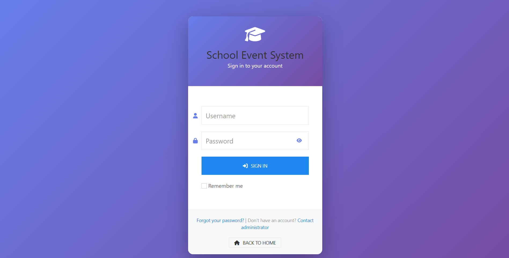

<h1 align="center">🎓 School Event Management System</h1>

A comprehensive web-based platform for managing school events efficiently and collaboratively. 
Designed to simplify event planning, participant registration, scheduling, and post-event analytics in one unified system.

  
  
  
  
  

---

<h3 align="center">✨ Key Features</h3>

- 🗓️ **Event Planning & Creation**  
  Organize and design school events with customizable details and resources.

- 🧾 **Participant Registration & Management**  
  Enable students, faculty, and guests to register and manage their participation easily.

- 🏫 **Venue & Resource Scheduling**  
  Schedule venues, rooms, and materials to prevent resource conflicts.

- 💌 **Invitation & Communication System**  
  Send event invitations and automated reminders via email or system notifications.

- 👥 **Attendance Tracking & Verification**  
  Monitor event attendance and validate participants using QR codes or ID verification.

- 💵 **Event Budget & Expense Tracking**  
  Record and manage financial transactions for each event.

- 📋 **Program Flow & Activity Monitoring**  
  Manage program timelines, activity logs, and event execution flow.

- 🎥 **Multimedia & Documentation Portal**  
  Store event-related media (photos, videos, documents) in a centralized gallery.

- 📝 **Feedback & Evaluation System**  
  Collect and analyze participant feedback for event improvement.

- 📊 **Event Report & Analytics**  
  Generate insightful reports and statistics for data-driven decision-making.

---

<h3 align="center">🛠️ Tech Stack</h3>

  
  
  
  
  
  

---

<h3 align="center">🖼️ Screenshots</h3>

  
   
  <em>Event Dashboard — Overview of ongoing and upcoming events</em>
    
  
   
  <em>Participant Login and Attendance Interface</em>

---

<h3 align="center">📈 Future Enhancements</h3>

- 📱 Mobile-responsive interface for easier access via smartphones.
- 🔔 Notification integration (Email / SMS) for event updates.
- 🧾 Auto-generated event certificates and attendance reports.
- 🤖 AI-based recommendation for event scheduling and resource optimization.
- 🌐 Integration with Google Calendar and school management systems.

---

<h3 align="center">👨‍💻 Author</h3>

  <b>Jaylord Casin</b> 
  🎓 Bestlink College of the Philippines — BSIT Student Project 
  <a href="https://github.com/superrjay" target="_blank">🌐 GitHub Profile</a>

---

<h4 align="center">🪪 License</h4>

This project is for educational and personal use only. 
Feel free to explore, learn, and enhance it.

